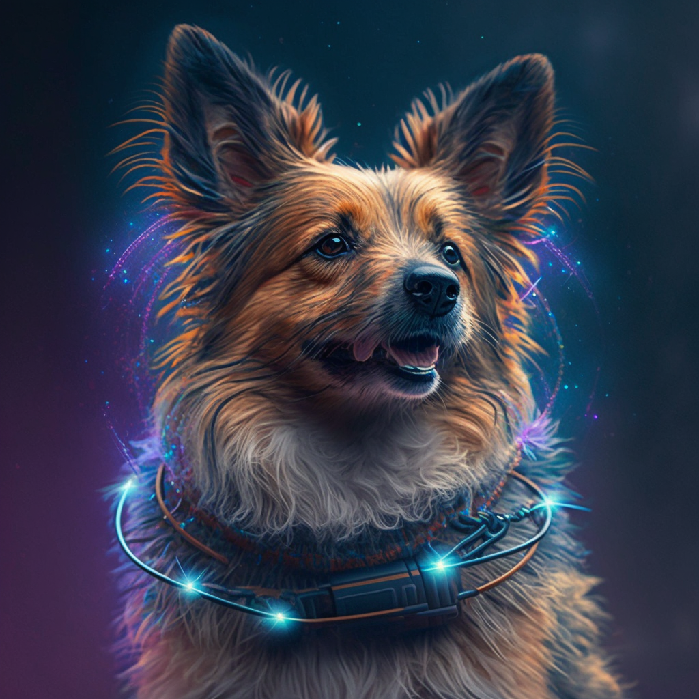

# SoroDogs: NFTs on Stellar using Soroban Platform

<div align="center">
    <a href="https://sorodogs.surge.sh">
        
    </a>
    <h3>Contract and Frontend for the SoroDogs NFTs<h3>
    <h3>38303ce284ff09e8ed8e44cb5263d5fa4cfc1fa155c0724e54e3d258ddb1bd09 on Soroban Futurenet</h3>
    <br />
    <h3>Built for <a href="https://hacka-soroban-athon.devpost.com/">Hacka-Soroban-athon 2023</a></h3>
</div>
<br />

## Contracts

The contracts are built using the [soroban-sdk](https://github.com/stellar/rs-soroban-sdk) and [Rust](https://www.rust-lang.org/). You can check the contracts [here](./contracts/).

## Frontend

The frontend is built using [TypeScript](https://www.typescriptlang.org/), [React](https://reactjs.org/), [Vite](https://vitejs.dev/), and [soroban-client](https://github.com/stellar/js-soroban-client). You can check it out [here](./src/).

## Requirements

1. [Rust](https://www.rust-lang.org/)
2. [Soroban CLI](https://soroban.stellar.org/docs/getting-started/setup)
3. [Node.js](https://nodejs.org/en/)
4. [Yarn](https://yarnpkg.com/)

## Usage

1. Clone or Fork this repository

```bash
git clone https://github.com/altugbakan/sorodogs
cd sorodogs
```

2. Install dependencies

```bash
yarn install
```

3. Start the development server

```bash
yarn run dev
```

## License

The frontend and the contracts are MIT licensed.
